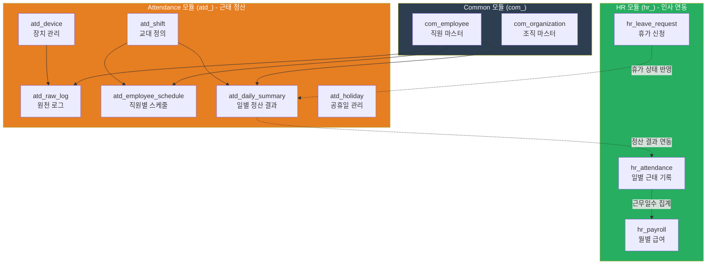
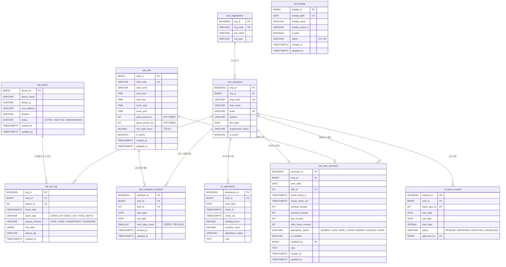

# 직원근태 관리 시스템 ERD (Entity Relationship Diagram)

> 전사 통합 DB 설계 기반 | PostgreSQL 16+ | 버전 1.0.0 | 2026-03-06

---

## 1. 전체 시스템 구조도 (High-Level)



---

## 2. 상세 ERD (테이블 관계도)



---

## 3. 테이블 상세 명세

### 3.1 장치 및 원천 로그 (Device & Raw Logs)

| 테이블 | 설명 | 예상 규모 |
|--------|------|-----------|
| **atd_device** | Hikvision 얼굴인식 등 출퇴근 장치 관리 | ~10건 (장치 수) |
| **atd_raw_log** | 장치 API에서 수집된 모든 체크인/체크아웃 원천 데이터 | 일 100~500건 |

### 3.2 근무 스케줄 설정 (Shift & Schedule)

| 테이블 | 설명 | 예상 규모 |
|--------|------|-----------|
| **atd_shift** | 표준근무, 반차, 야간 등 교대 유형 정의 | ~5-10건 |
| **atd_employee_schedule** | 직원별 기간별 적용 교대 매핑 | 직원수 x 변경 횟수 |

### 3.3 근태 정산 결과 (Calculated Summary)

| 테이블 | 설명 | 예상 규모 |
|--------|------|-----------|
| **atd_daily_summary** | 로우 로그를 분석하여 산출된 일별 근태 결과 | 일 50~100건 |
| **atd_holiday** | 공휴일/회사 휴무일 (정산 시 제외 기준) | 연 15~20건 |

---

## 4. 데이터 흐름도 (Data Flow)

```mermaid
flowchart LR
    A["Hikvision 장치<br/>(Face Recognition)"] -->|ISAPI 이벤트| B["atd_raw_log<br/>(원천 로그 저장)"]
    B -->|배치 정산<br/>(일 1회 또는 실시간)| C["atd_daily_summary<br/>(일별 근태 결과)"]

    D["atd_shift<br/>(교대 정의)"] --> C
    E["atd_employee_schedule<br/>(직원별 스케줄)"] --> C
    F["atd_holiday<br/>(공휴일)"] --> C
    G["hr_leave_request<br/>(승인된 휴가)"] -.-> C

    C -->|연동/대체| H["hr_attendance<br/>(HR 근태 기록)"]
    H -->|월 집계| I["hr_payroll<br/>(급여 계산)"]

    style A fill:#34495e,color:#fff
    style B fill:#34495e,color:#fff
    style C fill:#e67e22,color:#fff
    style D fill:#1abc9c,color:#fff
    style E fill:#1abc9c,color:#fff
    style F fill:#e67e22,color:#fff
    style G fill:#27ae60,color:#fff
    style H fill:#27ae60,color:#fff
    style I fill:#e74c3c,color:#fff
```

---

## 5. 핵심 인덱스 및 제약 조건

### Unique 제약
| 테이블 | 컬럼 | 목적 |
|--------|------|------|
| atd_daily_summary | (emp_id, work_date) | 직원별 날짜당 1건만 허용 |
| atd_holiday | holiday_date | 날짜 중복 방지 |
| atd_shift | shift_code | 교대 코드 유일성 |

### 주요 인덱스
| 테이블 | 인덱스 | 용도 |
|--------|--------|------|
| atd_raw_log | idx_atd_raw_emp | 직원별 로그 조회 |
| atd_raw_log | idx_atd_raw_time | 시간순 조회 |
| atd_raw_log | idx_atd_raw_emp_time | 직원+시간 복합 조회 (정산용) |
| atd_employee_schedule | idx_atd_sched_emp_date | 직원의 특정 날짜 스케줄 조회 |
| atd_daily_summary | idx_atd_summary_date | 날짜별 전체 근태 조회 |
| atd_daily_summary | idx_atd_summary_status | 상태별 필터링 (지각자 목록 등) |

---

## 6. 외래키 관계 요약

```
atd_raw_log.emp_id           --> com_employee.emp_id        (직원)
atd_raw_log.device_id        --> atd_device.device_id       (장치)

atd_employee_schedule.emp_id --> com_employee.emp_id        (직원)
atd_employee_schedule.shift_id --> atd_shift.shift_id       (교대)

atd_daily_summary.emp_id     --> com_employee.emp_id        (직원)
atd_daily_summary.shift_id   --> atd_shift.shift_id         (교대)
atd_daily_summary.modified_by --> com_employee.emp_id       (수정 관리자)
```

---

## 7. HR 모듈과의 연동 관계

| ATD 모듈 | 방향 | HR 모듈 | 연동 방식 |
|----------|------|---------|-----------|
| atd_daily_summary | --> | hr_attendance | 정산 결과를 HR 근태로 동기화 (또는 대체) |
| atd_daily_summary | <-- | hr_leave_request | 승인된 휴가를 LEAVE 상태로 반영 |
| atd_daily_summary | --> | hr_payroll | 월 근무일수/초과근무 집계하여 급여 산정 |
| atd_holiday | --> | hr_payroll | 유급 휴무일 급여 산정에 반영 |

---

## 8. attendance_status 코드 정의

| 코드 | 의미 | 판정 기준 |
|------|------|-----------|
| NORMAL | 정상 출근 | check_in <= shift.start_time + grace_period_in |
| LATE | 지각 | check_in > shift.start_time + grace_period_in |
| EARLY_LEAVE | 조퇴 | check_out < shift.end_time - grace_period_out |
| ABSENT | 결근 | 로그 없음 & 휴가/공휴일 아님 |
| HOLIDAY | 공휴일 | atd_holiday에 해당 날짜 존재 |
| LEAVE | 휴가 | hr_leave_request 승인 건 존재 |

---

## 9. work_days_mask 비트마스크 설명

```
비트 위치:  일  월  화  수  목  금  토
비트 값:     1   2   4   8  16  32  64

예시:
  월~금 근무 = 2+4+8+16+32 = 62
  월~토 근무 = 2+4+8+16+32+64 = 126
  화~토 근무 = 4+8+16+32+64 = 124
```

---

*본 ERD는 전사 통합 DB 설계(00_common.dbml, 03_hr.dbml, 04_attendance.dbml)를 기반으로 작성되었습니다.*
