# 전사 통합 ERD (Entity Relationship Diagram) 명세서

본 문서는 관세법인 UNI의 전사 통합 데이터베이스 설계(Common, CRM, ERP, HR)에 대한 시각적 구조와 상세 설명을 제공합니다.

---

## 1. 고수준 통합 아키텍처 (High-Level Schema)

```mermaid
erDiagram
    %% Common Module
    COMMON ||--o{ CRM : "Employee/Org Reference"
    COMMON ||--o{ ERP : "Employee/Org Reference"
    COMMON ||--o{ HR : "Employee Extension"
    COMMON ||--o{ ATD : "Employee Reference"

    %% Integration Links
    CRM ||--o{ ERP : "crm_company_id / crm_contract_id"
    
    subgraph Common_Module
        com_organization
        com_employee
        com_user_account
        com_role_permission
        com_audit_log
    end

    subgraph CRM_Module
        crm_company
        crm_contract
        crm_quotation
        crm_action
    end

    subgraph ERP_Module
        erp_import_export
        erp_balance
        erp_project
        erp_invoice
    end

    subgraph HR_Module
        hr_employee_detail
        hr_attendance
        hr_payroll
        hr_insurance
    end

    subgraph Attendance_Module
        atd_device
        atd_raw_log
        atd_daily_summary
        atd_shift
    end
```

---

## 2. 모듈별 상세 명세

### [A] Common 모듈 (com_) - 시스템 기반
전사 시스템의 뼈대가 되는 공통 기반 정보를 관리합니다.

*   **핵심 테이블 (14개):**
    *   `com_organization`: 법인-지사-부서 및 고객사 조직 계층을 통합 관리하는 기준.
    *   `com_employee`: 모든 임직원의 마스터 데이터.
    *   `com_user_account`: 시스템 로그인을 위한 계정 및 암호 관리.
    *   `com_role` / `com_permission`: 역할 기반 권한 제어(RBAC).
    *   `com_audit_log`: JSONB를 활용한 전사 공통 변경 이력(Auditing).

### [B] CRM 모듈 (crm_) - 고객 및 영업 이력
고객 발굴부터 계약 체결까지의 영업 파이프라인을 관리하며, **Insert-Only(버전 관리)** 정책을 따릅니다.

*   **핵심 테이블 (22개):**
    *   `crm_company`: 잠재/계약 고객사 관리 (버전별 이력 유지).
    *   `crm_action`: 상담, 방문, 통화 등 모든 영업 활동 기록.
    *   `crm_quotation`: 서비스 견적서 생성 및 확정 프로세스.
    *   `crm_contract`: 체결된 계약 정보 및 SOP(표준운영절차) 연결.
    *   `crm_marketing`: 뉴스레터 발송 및 CTA 클릭 분석을 통한 마케팅 성과 측정.

### [C] ERP 모듈 (erp_) - 수책관리 및 업무 집행
베트남 수책관리 실무와 인보이스 발행, 프로젝트 관리를 담당합니다.

*   **핵심 테이블 (30개):**
    *   `erp_import` / `erp_export`: 실제 통관 실적 데이터 (수입원장/수출원장).
    *   `erp_bom`: 제품당 원자재 소요량 관리 (수책 정산의 핵심).
    *   `erp_balance`: 수량/금액 단위의 수책 정산 원장.
    *   **통합 필드:** `erp_project`의 `crm_company_id`, `erp_invoice`의 `crm_contract_id`.
    *   `erp_invoice` / `erp_payment`: 관세법인 서비스 비용 청구 및 수금 관리.

### [D] HR 모듈 (hr_) - 인사 및 급여
베트남 현지 노동법과 한국인 주재원의 특수한 상황을 모두 아우르는 인사 시스템입니다.

*   **핵심 테이블 (17개):**
    *   `hr_employee_detail`: 개인정보, 학력, 경력 등 심화 인사정보.
    *   `hr_visa_permit`: 한국인 주재원의 비자/워크퍼밋 기간 및 만료 알림.
    *   `hr_attendance`: 근태 및 휴가 신청/승인 프로세스.
    *   `hr_payroll`: 베트남 사회보험 및 PIT(개인소득세)가 반영된 월별 페이롤.

### [E] Attendance 모듈 (atd_) - 근태 정산 및 장치 관리
출퇴근 장치(API)로부터 데이터를 수집하고 정산하는 상세 근태 솔루션입니다.

*   **핵심 테이블 (6개):**
    *   `atd_device`: 출퇴근 인식 장치(Hikvision 등)의 IP/위치 관리.
    *   `atd_raw_log`: 장치 API에서 수집된 모든 출퇴근 원천 로그.
    *   `atd_shift`: 표준/교대 근무 시간표 정의.
    *   `atd_daily_summary`: 원천 로그를 분석하여 산출된 일별 근태 결과(지각, 조퇴 등).

---

## 3. 핵심 통합 가이드 (Integration Guide)

### 1) 고객 정보의 이중 관리 및 동기화
*   `com_organization (Type=CLIENT)`: 조직도 상의 고객사 (Tax Code 중심).
*   `crm_company`: 영업 파이프라인 상의 고객사 (버전 관리 중심).
*   **연결:** 두 테이블은 `tax_code` 또는 `org_id`를 통해 매핑되어, 영업 이력과 실제 업무 실적을 통합 조회(vw_client_360)합니다.

### 2) 영업-운영-청구 파이프라인
*   `CRM 계약` → `ERP 프로젝트` 생성 (`crm_company_id`로 연결).
*   `ERP 프로젝트` 수행 및 실적 발생.
*   `ERP 인보이스` 발행 시 `crm_contract_id`를 참조하여 계약된 단가를 자동 적용.

### 3) 공통 기술 규약
*   **식별자:** 모든 테이블의 기본키(PK)는 `BIGSERIAL`을 사용합니다.
*   **감사:** CRM을 제외한 모든 UPDATE/DELETE 발생 시 `com_audit_log`에 트리거로 자동 기록됩니다.
*   **다국어:** 이름, 명칭 필드는 `_en`(영문), `_vi`(베트남어) 접미사를 통해 3개국어를 지원합니다.

---

*본 ERD 명세서는 전사 시스템 통합의 기준이 되며, 모든 개발은 본 설계를 바탕으로 진행됩니다.*
